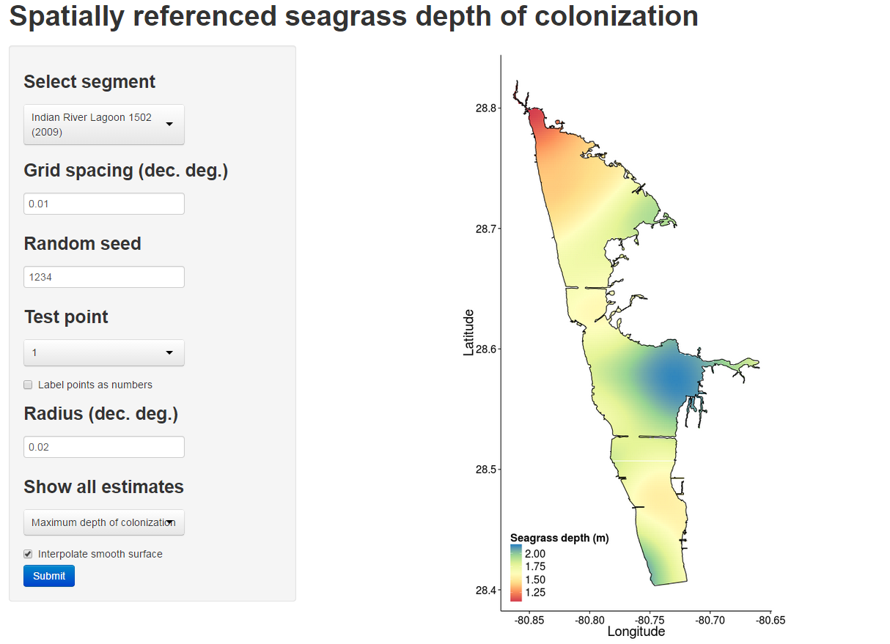

# Evaluation of segrass depth of colonization

Materials for seagrass depth of colonization estimates using a spatially-referenced approach, i.e., compliance point approach.  The web application is <a href="https://beckmw.shinyapps.io/sg_depth">here</a>.

# Screenshot

# To Do

correction to mean sea level given reference of tidal datum of bath points - Old Port Tampa 8726607